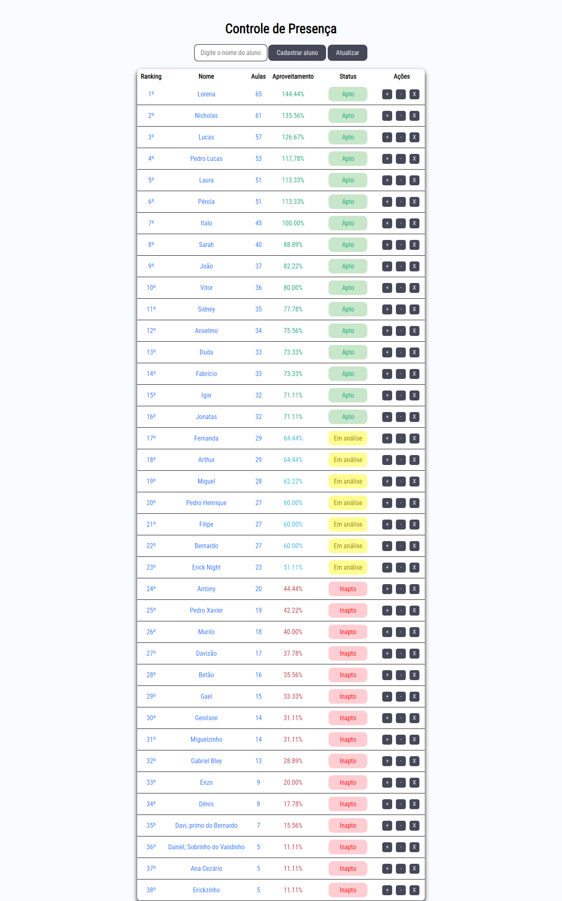

<h1 align="center"> BJJ Tracker </h1>

APLICAÇÃO FEITA POR ITALO COSTA  
 

  

## 🚀 Tecnologias

Esse projeto foi desenvolvido com as seguintes tecnologias:

- HTML e CSS
- JavaScript
- Git e Github

## 💻 Projeto

O BJJ TRACKER é um aplicação usada e atualizada no mundo real em uma acedemia de jiu-jitsu do Rio de Janeiro.  
A aplicação tem as seguintes funções:  
- Cadastrar aluno;  
- Atualizar tabela e ordenar em ordem decrescente baseado no número de aulas;  
- Mostra o status dos alunos (apto, em análise, inapto) de acordo com as regras da academia;  
- Adiciona aulas;  
- Subtrai aulas;  
- Exclui aluno.  

- [Acesse o projeto finalizado, online](https://bjj-tracker-ruby.vercel.app/)
---
Feito Por Italo Costa.